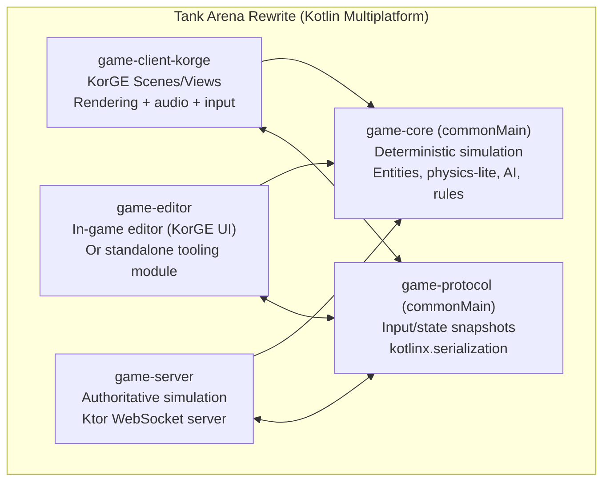
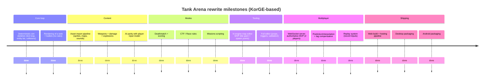

# Kotlin Multiplatform Game Engines for a Full Rewrite of Tank Arena

## Executive summary

A faithful-but-modern rewrite of a 1997 C/DOS 2D action game (tile/bitmap presentation, polymorphic object system, weapons/projectiles, AI, split-screen/local multiplayer, and a level editor) is **very achievable in Kotlin Multiplatform**—but only if you pick an engine that is both **mature** and **web-first enough** to hit your primary target (WebAssembly / web) without turning the project into constant platform triage.

Among the engines reviewed, **KorGE** stands out as the best overall fit: it is a dedicated Kotlin Multiplatform game engine with a long history, large release cadence (dozens of releases) and a comparatively large contributor base, and it explicitly targets JVM/Android, web (JS), and native (iOS + desktop) via its Gradle tooling. citeturn14view2turn21view0turn37search6turn19search0 It also has a visible ecosystem focus on practical 2D features (e.g., samples covering TileMap, Box2D, input, audio, scenes) and developer tooling (KorGE Forge editor, store integration, debugger). citeturn22search5turn37search10

If you are *extremely* WebGPU-focused and willing to accept a smaller maintainer base and a “framework, not engine” philosophy, **LittleKt** is the most credible alternative: it is explicitly a multiplatform WebGPU 2D framework, has a clear release history and recent commits, and even references WASM gamepad work in its repo history. citeturn13view0turn27search3turn12view0 However, key Tank Arena requirements (Android completeness, a strong editor story, mature asset/tooling pipeline) are not as clearly “done” as they are in KorGE, and its contributor count is small (6). citeturn27search3turn31search11

For an outright rewrite with an editor and multiplayer, you should also treat “WebAssembly” realistically: several Kotlin ecosystems explicitly note that **WASM targets can be constrained or still maturing** (e.g., Compose Multiplatform Web/Wasm being alpha in Kubriko’s own README; Kool documenting that its WASM browser target can be slower than JS due to interop overhead). citeturn27search2turn34search0 That doesn’t block the project, but it strongly influences your networking and tooling choices (e.g., prefer WebSockets/TCP semantics, deterministic simulation, and a server-authoritative design on the web).

## Evaluation criteria tailored to Tank Arena

To avoid a “pretty demo engine” trap, the evaluation below weights the things Tank Arena will actually stress:

Rendering: fast sprite batching, atlas workflows, pixel-perfect scaling, support for layered rendering (background/object/overlay), and optional shaders/filters for a modernized retro look.

Input: keyboard (including multiple local players), gamepad, and sane abstraction for remapping controls.

Audio: low-latency SFX and streaming music with cross-platform constraints (especially browser audio autoplay restrictions).

Asset pipeline: async loading, packer/atlas support, import of tilemaps, and practical workflows for paletted/pixel assets.

Tooling: IDE integration, debugging, hot reload/live preview, and—critically—how painful it is to build a level editor as either an in-engine tool or a standalone app.

Networking: not “does it ship ENet,” but “can we build a robust multiplayer layer that also works in the browser,” which generally implies WebSockets and/or a shared protocol layer.

Community and maintenance: releases, recent commits, contributor base, documentation quality, and evidence of real projects built with it.

Licensing: permissive vs copyleft implications for commercial distribution and for mixing with your legacy GPL codebase (even if you later relicense, dependencies still matter).

## Engine baseline profiles

The following table summarizes the engines you explicitly named (interpreting **“Kobriko” as “Kubriko”**—the evidence points to Kubriko as the Compose Multiplatform engine people refer to in this niche) plus a couple of smaller KMP entrants that show up in current Kotlin game-dev discussions.

> Note on contributor counts: GitHub’s public UI sometimes fails to render contributor widgets reliably in automated captures; where possible, the table uses sources that explicitly list a contributor count. When an exact count could not be extracted from accessible sources, it is marked accordingly and the report cites what *is* known.

| Engine | Short description | Official repo / site | Latest release (tag, date) | Contributors | Evidence of activity (last 12 months) | Notable usage examples |
|---|---|---|---|---:|---|---|
| KorGE | Kotlin Multiplatform game engine; positioned as top layer of the “Korlibs” stack; ships tooling including an editor/debugger ecosystem. citeturn37search6turn22search5 | GitHub: `korlibs/korge`; KorGE site & docs. citeturn21view0turn22search5turn37search6 | `v6.0.0` — May 15–16, 2025. citeturn14view2turn12view3 | Open Hub analysis lists **81 contributors** (and thousands of commits). citeturn19search0 | Releases within the last year; documentation actively crawled recently; samples list continues to be curated. citeturn14view2turn37search10 | KorGE site highlights “Jobe’s Legacy” as a KorGE game. citeturn22search5 |
| LittleKt | Kotlin Multiplatform **WebGPU 2D game framework** (“build your own engine on top”); focuses on Desktop (JVM) + Browser and references WASM-specific input work. citeturn15view1turn27search3 | GitHub: `littlektframework/littlekt`; LittleKt site & docs. citeturn15view1turn19search5turn22search8 | `v0.11.0` — Dec 14, 2024. citeturn13view0turn12view0 | GitHub snippet shows **6 contributors**. citeturn27search3 | Repo shows commits “3 months ago” and multiple commits “4 months ago,” including “gamepad support for WASM.” citeturn27search3 | LittleKt samples include multiple game-style examples (e.g., a Flappy Bird clone referenced in samples repo snippet). citeturn27search0turn19search12 |
| Kool | Kotlin multiplatform graphics engine spanning Vulkan/WebGPU/OpenGL across Desktop JVM, Android, and Browser; includes physics modules and a scene editor (still early). citeturn34search0turn23search6 | GitHub: `kool-engine/kool`; docs site. citeturn21view2turn23search6 | `v0.19.0` — Dec 20, 2025. citeturn14view0turn12view2 | **Not reliably extractable** from accessible sources; releases credit external contributors (e.g., `bat1set`) and the project is strongly associated with maintainer `fabmax`. citeturn12view2turn34search0 | Explicit platform matrix includes Browser (JS + WASM) and discussion that WASM can be slower than JS due to interop upcalls; many demos + Dec 2025 release. citeturn34search0turn14view0 | README says “I also made an actual game with this: Blocks and Belts.” citeturn34search0 |
| Kubriko (likely what you meant by “Kobriko”) | 2D engine based on Compose Multiplatform; modular plugins covering input/audio/shaders/physics; includes tools like Scene Editor + Debug Menu; warns that Compose/Wasm export is alpha. citeturn27search2turn29view2 | GitHub: `pandulapeter/kubriko`; project site. citeturn15view3turn19search11 | `0.0.8` — Jan 29, 2026. citeturn14view1turn12view1 | **Not reliably extractable**; release notes name multiple contributors across releases (e.g., Ninjars, dsokolov). citeturn12view1turn11view3 | Recent release Jan 2026 and “last activity about 1 month ago” in ecosystem metadata. citeturn14view1turn29view2 | Engine ships a “Showcase app” and explicitly lists Scene Editor tooling. citeturn27search2turn25search15 |
| Kross2D | Small Kotlin multiplatform 2D library aiming for minimal API; explicitly mentions Kotlin multiplatform and “JVM and web backends.” citeturn9view5 | GitHub: `bitspittle/kross2d`. citeturn9view5turn31search3 | No releases published. citeturn10view5 | **Not reliably extractable** from accessible sources. citeturn15view4 | Low stars and no releases; treat as experimental for a large game rewrite. citeturn9view5turn10view5 | None widely documented. citeturn9view5 |
| Kolpa | Very early-stage “Kotlin Multiplatform based game engine” repo; no releases, only a handful of commits. citeturn9view4turn10view2 | GitHub: `kolpa-engine/kolpa`; site exists but repo reveals maturity. citeturn9view4turn28search2 | No releases. citeturn10view2turn9view4 | GitHub shows **1 contributor**. citeturn28search6 | Only 4 commits visible; not suitable for Tank Arena scale today. citeturn9view4 | None widely documented. citeturn9view4 |

### Licensing snapshot

KorGE’s docs state the KorGE/korlibs ecosystem uses permissive licensing, described as dual MIT/Apache 2.0 (or CC0 for some parts), and the KorGE repo includes Apache-style license text. citeturn36search1turn36search0turn36search4 LittleKt and Kool are Apache-2.0 licensed in their GitHub metadata. citeturn21view1turn21view2 Kubriko is MPL-2.0 and explicitly states that you can build proprietary games *with the engine*, but forks/competing engines must remain open source (a typical MPL “file-level copyleft” posture). citeturn21view3turn21view3 Kolpa’s repo is GPL-3.0. citeturn9view4turn28search6 Kross2D is MIT licensed. citeturn9view5

## Comparison matrix and ranked recommendation

### Key capability matrix for Tank Arena

| Dimension | KorGE | LittleKt | Kool | Kubriko | Kross2D | Kolpa |
|---|---|---|---|---|---|---|
| Kotlin Multiplatform targets | Explicitly targets JVM/Android, Web (JS), Native (iOS + desktop) via Gradle plugin. citeturn37search6turn37search9 | Desktop (JVM) + Web (JS) working; Android “in progress,” iOS “planned” per repo’s platform table. citeturn27search3turn31search11 | Desktop (JVM), Android, Browser (JS + WASM) explicitly documented. citeturn34search0turn12view2 | Aims for Android, Desktop, iOS, Web; notes Compose/Wasm is alpha for web. citeturn27search2turn29view2 | Conceptually KMP; mentions JVM + potential web backends. citeturn9view5 | Claims KMP but extremely early and unproven. citeturn9view4 |
| Web / WASM posture | Targets Web via JS, and the ecosystem discusses WebAssembly as a target in docs tooling; KorGE docs and distribution pages cover multiplatform entrypoints. citeturn37search6turn37search9 | Explicit commits mention WASM gamepad support; Web target is central. citeturn27search3turn19search12 | Explicitly supports JS and WASM, but documents that WASM can be slower than JS due to JS interop overhead; recommends JS in many cases. citeturn34search0 | Web exists but Compose/Wasm is “currently in alpha” (engine warns this applies to web builds). citeturn27search2turn29view2 | Not clearly demonstrated. citeturn9view5 | Not clearly demonstrated. citeturn9view4 |
| 2D suitability | Explicit 2D engine; sample catalog includes TileMap, Box2D, sprites, filters, input, UI, audio. citeturn37search10turn22search5 | 2D-focused; “build your own engine on top.” citeturn15view1turn27search3 | Primarily 3D-oriented but includes “preview of Box2D based 2D physics” in releases and a 2D physics demo description in README excerpt. citeturn12view2turn34search0 | 2D engine; modular plugins for many “simple game” needs. citeturn27search2turn29view2 | 2D library, minimal. citeturn9view5 | Too early. citeturn9view4 |
| Editor story | KorGE Forge editor advertised as a core feature + debugger. citeturn22search5turn37search6 | No first-class editor story evident; expect custom. citeturn27search3 | Scene editor exists but explicitly “early” in docs. citeturn23search6turn34search0 | Ships Scene Editor + Debug Menu tooling explicitly. citeturn27search2turn25search15 | None. citeturn9view5 | None. citeturn9view4 |
| Community maturity signals | 3k stars + 88 releases; OpenHub indicates large contributor base. citeturn21view0turn19search0 | Moderate scale (hundreds of stars); releases are present but contributor base small. citeturn12view0turn27search3 | Moderate scale; active releases through Dec 2025; many demo assets. citeturn14view0turn34search0 | Active but explicitly “early stages of development.” citeturn27search2turn29view2 | Very small. citeturn9view5 | Very small. citeturn9view4 |
| Licensing | Permissive dual licensing described in docs (MIT/Apache 2.0 / CC0 exceptions). citeturn36search1turn36search4 | Apache-2.0. citeturn21view1turn22search16 | Apache-2.0. citeturn21view2turn10view1 | MPL-2.0; engine explicitly allows proprietary games but requires open sourcing derivative engines/forks. citeturn21view3turn21view3 | MIT. citeturn9view5 | GPL-3.0. citeturn9view4turn28search6 |

### Ranked recommendation

KorGE is the most mature, most “complete game engine” choice for rewriting Tank Arena with a real editor workflow and multi-target builds (web + desktop + Android). Its positioning is explicitly multiplatform with a Gradle-based workflow, and it markets productivity features (Forge editor, debugger, store) that directly reduce the cost of porting the level editor and iterating on gameplay. citeturn22search5turn37search6turn37search9turn21view0 The breadth of its sample catalog—explicitly listing TileMap, Box2D, input, audio, UI, scenes—matches Tank Arena’s core mechanics and workflow needs. citeturn37search10

LittleKt is the best “web-performance-first” alternative when you want to build a custom engine architecture and accept that some platform targets are still in progress/planned in the project’s own platform table (notably Android and iOS/Native). citeturn27search3turn31search11 It is very compelling if you plan to modernize visuals using a WebGPU-centric render path and you are prepared to build your own editor on top.

Kool is a strong technology platform but is better viewed as a graphics/3D-first engine that *can* do 2D, rather than a 2D game engine optimized for tile/sprite workflows. Its own docs caution about WASM performance vs JS, which can matter if your priority target is WebAssembly. citeturn34search0

Kubriko is promising for “engine + tools” (Scene Editor, Debug Menu), but it explicitly flags the web target’s foundation (Compose/Wasm) as alpha and describes the engine as early-stage—this is riskier than KorGE for a rewrite of a full game + editor. citeturn27search2turn29view2

## Step-by-step rewrite blueprint for Tank Arena in KorGE

This section assumes a **full rewrite** (not a line-by-line translation) while preserving the gameplay feel, retro pixel style, and extensible “objectstruct polymorphism” architecture you described.

### Target architecture

The highest-leverage decision is to **separate the deterministic game simulation from the rendering/input layer**:

- Put *all* gameplay state updates (movement, collisions, weapons, AI, scoring, mission logic) into a pure Kotlin **`commonMain`** module with no engine dependencies.
- Use KorGE only as: rendering, audio playback, input collection, asset IO, and platform integration.

This pays off immediately for:
- multiplayer determinism and testability,
- headless simulation (server authority),
- and future ports (desktop vs web vs mobile). citeturn37search9

A practical module layout:



KorGE’s deployment docs emphasize the multiplatform source-set structure (e.g., `src/commonMain/kotlin`, `src/jsMain/kotlin`) and that KorGE expects a `suspend fun main()` entry point. citeturn37search9

### Project setup

Use KorGE’s standard entrypoint conventions:

- Entry point must be a **`suspend fun main()` without arguments**. citeturn37search9turn37search7
- Use a **virtual resolution** to keep pixel art stable across window sizes; KorGE’s resolutions guide explains the “virtualWidth/virtualHeight” idea for consistent in-game coordinates. citeturn37search4

Sample initialization pattern (illustrative, based on KorGE examples in issues):

```kotlin
import com.soywiz.korge.Korge
import com.soywiz.korma.geom.Size

suspend fun main() = Korge(
    windowSize = Size(640, 480),
    virtualSize = Size(640, 480),
) {
    // Start scene / game here
}
```

KorGE examples in the issue tracker show this `Korge(windowSize = ..., virtualSize = ...)` pattern in real code. citeturn37search14turn37search7

### Translating `objectstruct` polymorphism into Kotlin

Your existing architecture (function pointers inside a giant tagged union) maps very cleanly into Kotlin:

- Each object type becomes a class (or data class).
- Replace function pointers with overridable methods or strategy interfaces.
- Replace the `union d { tankstruct … }` with typed composition.

Two viable Kotlin idioms:

#### OOP base class with per-entity overrides

This is the closest to the original engine design.

```kotlin
sealed class Entity(
    val id: Int,
    var alive: Boolean = true,
) {
    abstract fun update(sim: SimContext, dtTicks: Int)
    abstract fun render(r: RenderContext)
    open fun onHit(sim: SimContext, hit: Hit) {}
    open fun onRemove(sim: SimContext) {}
}

final class TankEntity(
    id: Int,
    val playerIndex: Int,
    var x: Int,
    var y: Int,
    var vx: Int = 0,
    var vy: Int = 0,
) : Entity(id) {
    override fun update(sim: SimContext, dtTicks: Int) {
        // deterministic fixed-step movement
        x += vx * dtTicks
        y += vy * dtTicks
        // collisions, weapon cooldowns, etc.
    }

    override fun render(r: RenderContext) {
        r.drawSprite("tank", x, y)
    }
}
```

Key recommendation for multiplayer: use **integer / fixed-point math** in `game-core` to reduce cross-platform floating differences (especially between JS/WASM/JVM).

#### ECS-style composition (only if it really helps)

If you expect exponential object types and lots of shared behaviors, you can move to a small ECS (Entity + Components + Systems). KorGE even has community examples combining KorGE with ECS libraries (e.g., KorGE-Fleks is explicitly “based on KorGE … and Fleks ECS”). citeturn25search21  
For Tank Arena specifically, the OOP approach is usually faster to implement because the original engine already models “objects as polymorphic behaviors.”

### Rendering pipeline for “modern retro pixel art”

Tank Arena’s “layers” map to a stable modern approach:

- **Background layer**: pre-rendered tilemap/terrain to a render texture (or a cached view subtree).
- **Entity layer**: dynamic sprites (tanks, bullets, debris).
- **Overlay layer**: UI, radar/minimap, score, debug.

KorGE’s samples list explicitly includes TileMap and Tiled Background examples, which is a strong signal the engine ecosystem supports the workflow you need for background layers and tile-driven maps. citeturn37search10

Use a fixed virtual resolution and integer scaling:

- Set `virtualSize` to a canonical retro resolution (defaults: 640×480 or 320×240).
- Keep sprites aligned to integer coordinates in world space (or snap after physics).
- Apply “modern look” via optional post-processing shaders/filters (scanlines, subtle bloom) **without** subpixel jitter.

KorGE’s resolution guide explains why virtual size decouples gameplay coordinates from pixel output size, which is foundational for pixel-perfect scaling across desktop and web. citeturn37search4

### Input mapping for local multiplayer and gamepads

Tank Arena starts as “2 players on one keyboard.” Your rewrite should generalize this to a **device-agnostic action map**:

- Define gameplay actions: `MOVE_X`, `MOVE_Y`, `FIRE_PRIMARY`, `FIRE_SECONDARY`, `SWITCH_WEAPON`, `MENU_ACCEPT`, etc.
- Provide multiple “bindings” per action: keyboard scancodes, gamepad buttons/axes, on-screen touch controls for mobile.

KorGE’s sample catalog explicitly lists “Input” and “OnScreen Controller,” which matches the control abstraction work you’ll need for mobile/web parity. citeturn37search10

For WebAssembly/web specifically, be strict about input focus handling and “click-to-focus” issues; browsers can drop focus unexpectedly, and on-screen UI must coexist with the game canvas.

If you were to choose LittleKt instead, it has explicit repo history entries around WASM gamepad support. citeturn27search3 That’s a good indicator for web controller work, but KorGE’s broader tooling still tends to win for a full game + editor.

### Audio

Keep audio APIs out of `game-core`. Model audio in the simulation as **events**:

- `PlaySfx("explosion_small")`
- `StartMusic("mission_01")`
- `StopMusic()`

Then the KorGE client consumes events and plays actual audio.

KorGE’s sample catalog includes “Polyphonic Audio,” which suggests the ecosystem interprets audio as a first-class part of game demos and likely provides practical patterns. citeturn37search10

### Physics, collisions, and determinism

For a fast 2D action game, you usually want **predictable arcade physics**, not “realistic.”

Two implementation options:

- A custom collision system: AABB + circles + simple impulses (closest to your original).
- Box2D integration for robust collisions and joints.

KorGE’s own samples list explicitly includes “Box2D,” and there are KorGE issues discussing Box2D integration (“Better integration with Box2d”), indicating that Box2D is part of the KorGE universe—even if the integration may have rough edges. citeturn37search10turn36search17

If you plan networked multiplayer, strongly consider:
- fixed simulation tick (e.g., 60 ticks/sec),
- integer/fixed-point state,
- and a server-authoritative model (details below).

### Weapons, projectiles, AI

Treat weapons/projectiles as entities, but optimize for high counts:

- Pool projectile entities (avoid frequent allocations in tight loops).
- Precompute sprite references/IDs.
- Separate “hit detection” from “visual effects.”

For AI, keep it in `game-core` reading from the world state and writing “intent” actions, the same way players do. This symmetry becomes extremely valuable for replay systems and multiplayer debugging.

### Editor porting strategy

You said: “Yes, also include the editing tools and level editor.” The safest approach is to build an **in-engine editor mode** first:

- It runs everywhere the game runs (web, desktop, Android) without separate UI stacks.
- It reuses the same render + input systems.
- It ensures the editor is never “a different product.”

Kubriko’s ecosystem shows a pluginized approach with dedicated tooling modules (e.g., packages like `tool-scene-editor-*` are published). citeturn25search15turn29view2 That’s a good conceptual blueprint: keep editor tooling modular so you can ship game builds without them.

For KorGE, you can implement the editor as:
- a KorGE “Scene” (enter editor mode from the main menu),
- plus a set of UI panels (tile palette, entity list, properties inspector),
- plus serialization to a human-diffable format.

Use `kotlinx.serialization` and store levels as JSON (or a compact binary for runtime, but JSON for editing). The format should be versioned.

## Multiplayer for web, desktop, and Android under WASM constraints

Tank Arena-style gameplay can work well online, but the design must respect web constraints:

- Browsers don’t give you raw UDP sockets; WebSockets are the practical default for web clients.
- Determinism across JS/WASM/JVM is hard if you use floating-point physics.
- Anti-cheat and desync handling are easier with an authoritative server.

### Recommended netcode model

Use a **server-authoritative simulation**:

- Clients send *inputs* (per tick).
- Server simulates authoritative state.
- Server sends snapshots (or state diffs) at a controlled rate (e.g., 10–20 Hz).
- Clients render predicted/interpolated state; reconcile on correction.

This works with WebSockets (reliable) and avoids fighting browser UDP limitations. Kool’s documentation explicitly points out that WASM in the browser can incur overhead due to JS-interop calls, so keeping the browser-side simulation lighter and relying on server authority is often a net win. citeturn34search0

### Serialization and protocol

Keep the protocol in a `commonMain` module with versioning:

```kotlin
@Serializable
sealed interface Msg {
    val protocolVersion: Int
}

@Serializable
data class InputMsg(
    override val protocolVersion: Int,
    val playerId: Int,
    val tick: Int,
    val moveX: Int,  // -1,0,1
    val moveY: Int,  // -1,0,1
    val fire: Boolean,
    val weapon: Int,
) : Msg

@Serializable
data class SnapshotMsg(
    override val protocolVersion: Int,
    val tick: Int,
    val entities: List<EntityState>,
) : Msg
```

### Minimal WebSocket sketch (Ktor-style)

This is intentionally minimal (MWE-level). The exact server engine (Netty/CIO) and platform wiring will vary by target.

Server:

```kotlin
fun main() {
  embeddedServer(Netty, port = 8080) {
    install(WebSockets)
    routing {
      webSocket("/ws") {
        for (frame in incoming) {
          // decode InputMsg, push into server sim queue
          // periodically send SnapshotMsg
        }
      }
    }
  }.start(wait = true)
}
```

Client:

```kotlin
val client = HttpClient { install(WebSockets) }
client.webSocket(urlString = "ws://localhost:8080/ws") {
  // send InputMsg each tick
  // receive SnapshotMsg and reconcile
}
```

For web builds, host the server separately (a JVM server is simplest) and deploy the client as static web assets.

### Where KorGE helps the workflow

KorGE documentation emphasizes debugging via IntelliJ (e.g., running tasks like `runJvm` in debug mode), which is essential when you start doing prediction/reconciliation and need frame+tick introspection. citeturn37search1turn37search6

Also, KorGE’s developer tooling marketing (debugger, editor) matters a lot for multiplayer because you will want:
- “visualize hitboxes,”
- “show last authoritative tick,”
- “show RTT/jitter,”
- and “rewind/step simulation” tooling during development.

KorGE explicitly markets debugger support and an editor environment (Forge). citeturn22search5turn37search6

## What to port first: a realistic migration timeline

A rewrite succeeds when you can play something quickly and iterate. A sensible order:



“Done” here means “feature-complete enough to iterate,” not polished.

## Final recommendation

For a full rewrite of Tank Arena that must hit **WebAssembly/web**, **desktop**, **Android**, and includes a **level editor**, the best-maintained and most mature Kotlin Multiplatform engine in this comparison is **KorGE**. It combines a large ecosystem footprint (many releases; large contributor history), practical 2D feature signals (TileMap/Box2D/audio/input samples), and an explicit productivity/tooling story (KorGE Forge editor + debugger) that directly reduces the cost of porting and maintaining the editor. citeturn21view0turn19search0turn37search10turn22search5turn37search6

If your top priority becomes “WebGPU-first rendering and we’ll build all tooling ourselves,” **LittleKt** is the strongest alternative—but accept that its own platform table lists Android as “in progress” and iOS/Native as “planned,” and its contributor base is small. citeturn27search3turn31search11turn12view0